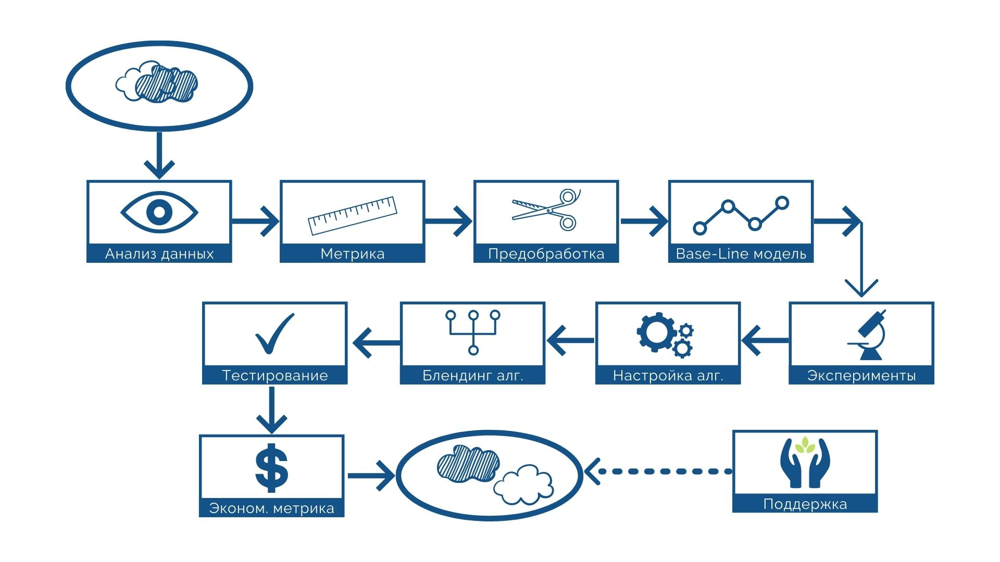

# Специализация "Машинное обучение и анализ данных"

## Прогнозирование оттока пользователей

**Ингинен Вера Максимовна**

Краткий отчет по выполненной работе [здесь](https://www.canva.com/design/DAD-gXhX7OI/BIqldbkPnHYYEteHpiAyyA/view?utm_content=DAD-gXhX7OI&utm_campaign=designshare&utm_medium=link&utm_source=sharebutton)

Соревнование на площадке Kaggle ["Прогнозирование оттока пользователей"](https://www.kaggle.com/c/telecom-clients-prediction2?rvi=1)

### Цели и задачи проекта

**Идея**: Поведение пользователей, которые скорее всего уйдут к конкуренту, меняется за некоторое время до момента полного отказа от сервиса.

**Цель**: Научиться заблаговременно находить пользователей, склонных к оттоку.

**Задача**: Построение рабочей модели, позволяющей идентифицировать пользователя по реальным входным данным

**Актуальность**: Задача прогнозирования оттока актуальна для большинства организаций, оказывающих услуги:
- телекоммуникационные операторы 
- ритейл
- банки, страховые компании
- интернет-порталы, интернет-магазины
- досуговые сервисы и пр.

## Описание решения

* [Код в Jupiter Notebook с визуализацией данных и описанием самой успешной модели из исследования](Churn_Inginen.md)
