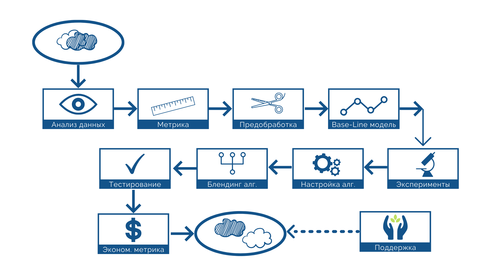
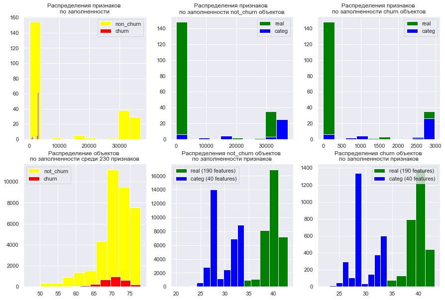
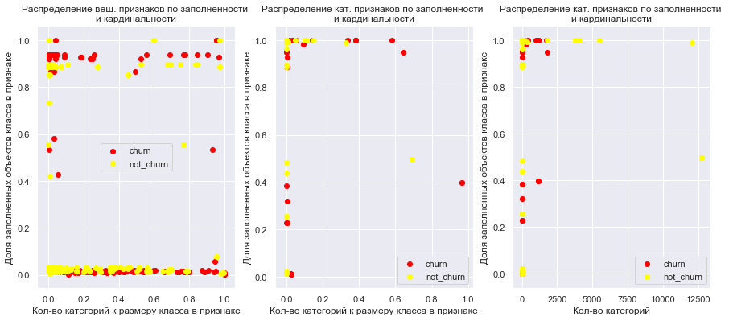
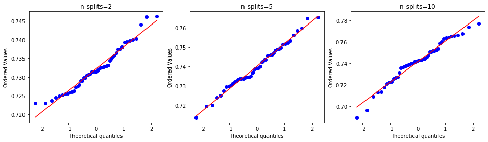
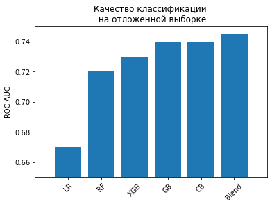
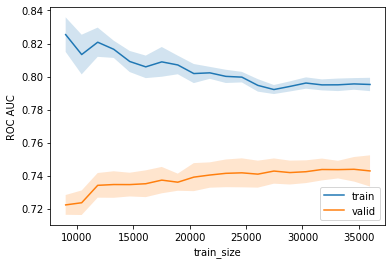
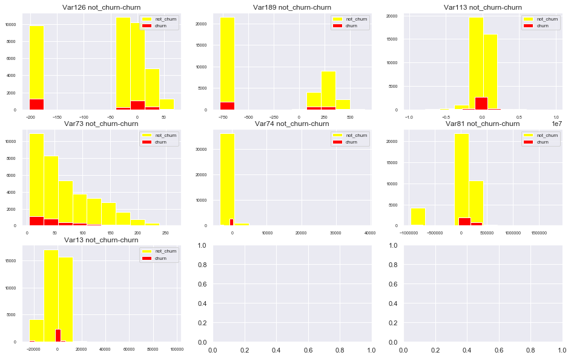
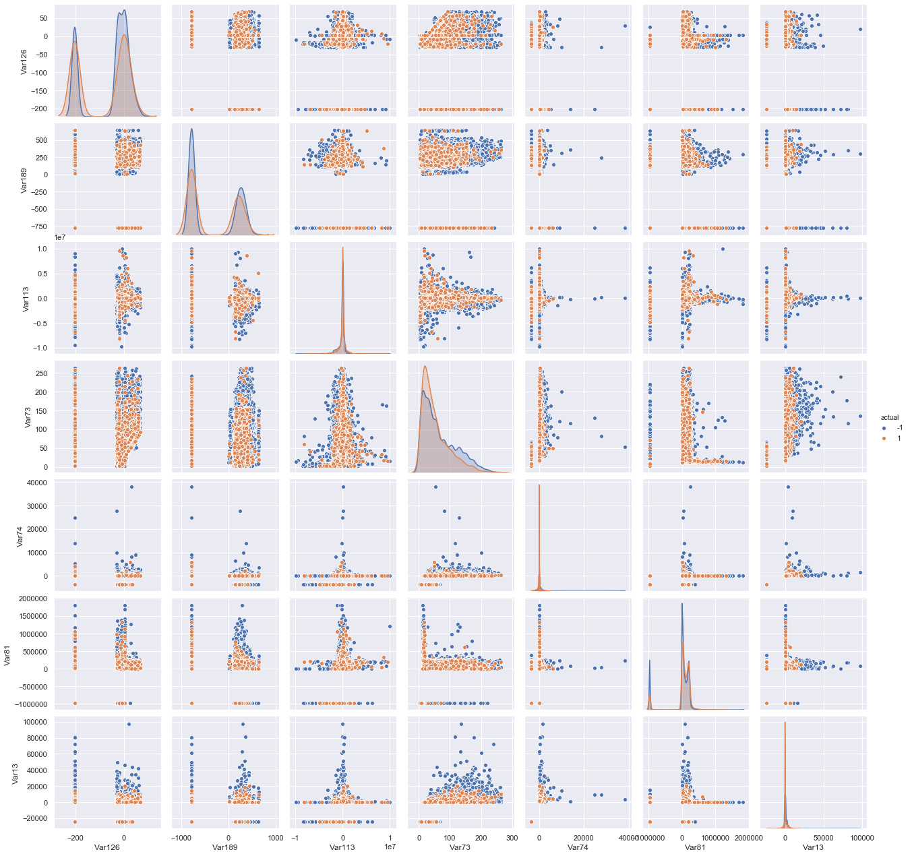
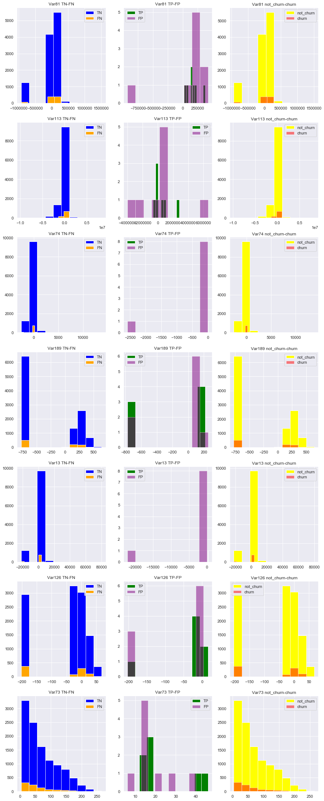
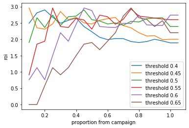

# Специализация "Машинное обучение и анализ данных"

## Прогнозирование оттока пользователей

**Ингинен Вера Максимовна**

Краткий отчет по выполненной работе [здесь](https://www.canva.com/design/DAD-gXhX7OI/BIqldbkPnHYYEteHpiAyyA/view?utm_content=DAD-gXhX7OI&utm_campaign=designshare&utm_medium=link&utm_source=sharebutton)

Соревнование на площадке Kaggle [Прогнозирование оттока пользователей](https://www.kaggle.com/c/telecom-clients-prediction2?rvi=1)

### Цели и задачи проекта

**Идея**: Поведение пользователей, которые скорее всего уйдут к конкуренту, меняется за некоторое время до момента полного отказа от сервиса.

**Цель**: Научиться заблаговременно находить пользователей, склонных к оттоку.

**Задача**: Построение рабочей модели, позволяющей идентифицировать пользователя по реальным входным данным

**Актуальность**: Задача прогнозирования оттока актуальна для большинства организаций, оказывающих услуги:
- телекоммуникационные операторы 
- ритейл
- банки, страховые компании
- интернет-порталы, интернет-магазины
- досуговые сервисы и пр.

## План
 - [Описание решения](#описание-решения)
 - [Описательный анализ данных](#анализ-признаков)
 - [Выбор метрики, критерии оценки модели, pipeline](#Критерии-оценки-модели)
 - [Предобработка данных](#Эксперименты-на-этапе-предобработки-данных)
 - [Обучение моделей, функция проверки двусторонних гипотез](#Обучение-алгоритмов-на-лучших-параметрах-предобработки-выборки)
 - [Настройка параметров алгоритмов](#Настройка-алгоритмов)
 - [Ансамблирование](#Блендинг-ответов-различных-классификаторов)
 - [Точка роста модели](#Перспективы-улучшения)
 - [Экономический эффект](#Оценка-потенциального-экономического-эффекта-от-внедрения-полученного-решения)
 - [АB тест](#Дизайн-возможного-АB-теста)
 - [Итоги](#Итоги)


```python
from __future__ import division, print_function
import warnings
warnings.filterwarnings('ignore')

import os
import numpy as np
import pandas as pd
import scipy as scp

import seaborn as sns
import eli5
from IPython.display import display_html
from tqdm import tqdm
from matplotlib import pyplot as plt

import category_encoders as ce
from catboost import CatBoostClassifier, Pool, cv

from sklearn.model_selection import cross_val_score, StratifiedKFold, GridSearchCV, train_test_split, learning_curve, RepeatedStratifiedKFold
from sklearn.metrics import roc_auc_score, confusion_matrix
from sklearn.preprocessing import StandardScaler, OneHotEncoder, FunctionTransformer
from sklearn import pipeline
from sklearn.impute import SimpleImputer
from sklearn.linear_model import LogisticRegression
from sklearn.ensemble import GradientBoostingClassifier, RandomForestClassifier

from xgboost import XGBClassifier

from itertools import product, permutations, combinations

%matplotlib inline
```

[Наверх](#План)

## Описание решения


```python
from IPython.display import Image
Image("project_steps.png")
```





## Исходные данные
Источник: соревнование на площадке kaggle. Предоставлены французской  телекоммуникационной компанией и не содержат персональную информацию и описания переменных. Сделать некоторые предварительные предположения о природе признаков и их связи друг с другом невозможно.


```python
PATH_TO_DATA = r'C:\Users\Admin\Desktop\ML\6-FinalProject\ChurnPrediction'
SEED = 17
```


```python
data = pd.read_csv(os.path.join(PATH_TO_DATA, 'orange_small_churn_data.txt'))
X = pd.read_csv(os.path.join(PATH_TO_DATA, 'orange_small_churn_data.txt'))
X_test = pd.read_csv(os.path.join(PATH_TO_DATA, 'orange_small_churn_test_data.csv'), index_col='ID')
y = pd.read_csv(os.path.join(PATH_TO_DATA, 'orange_small_churn_labels.txt'), names=['actual']).values.ravel()

real_features = X.columns[:190]
categ_features = X.columns[190:]
data['actual'] = y

X[categ_features] = X[categ_features].astype('category')
X_test[categ_features] = X_test[categ_features].astype('category')

X.shape, X_test.shape, y.shape
```


    ((40000, 230), (10000, 230), (40000,))


```python
data.head()
```


<div>
<style scoped>
    .dataframe tbody tr th:only-of-type {
        vertical-align: middle;
    }

    .dataframe tbody tr th {
        vertical-align: top;
    }

    .dataframe thead th {
        text-align: right;
    }
</style>
<table border="1" class="dataframe">
  <thead>
    <tr style="text-align: right;">
      <th></th>
      <th>Var1</th>
      <th>Var2</th>
      <th>Var3</th>
      <th>Var4</th>
      <th>Var5</th>
      <th>Var6</th>
      <th>Var7</th>
      <th>Var8</th>
      <th>Var9</th>
      <th>Var10</th>
      <th>...</th>
      <th>Var222</th>
      <th>Var223</th>
      <th>Var224</th>
      <th>Var225</th>
      <th>Var226</th>
      <th>Var227</th>
      <th>Var228</th>
      <th>Var229</th>
      <th>Var230</th>
      <th>actual</th>
    </tr>
  </thead>
  <tbody>
    <tr>
      <th>0</th>
      <td>NaN</td>
      <td>NaN</td>
      <td>NaN</td>
      <td>NaN</td>
      <td>NaN</td>
      <td>3052.0</td>
      <td>NaN</td>
      <td>NaN</td>
      <td>NaN</td>
      <td>NaN</td>
      <td>...</td>
      <td>vr93T2a</td>
      <td>LM8l689qOp</td>
      <td>NaN</td>
      <td>NaN</td>
      <td>fKCe</td>
      <td>02N6s8f</td>
      <td>xwM2aC7IdeMC0</td>
      <td>NaN</td>
      <td>NaN</td>
      <td>-1</td>
    </tr>
    <tr>
      <th>1</th>
      <td>NaN</td>
      <td>NaN</td>
      <td>NaN</td>
      <td>NaN</td>
      <td>NaN</td>
      <td>1813.0</td>
      <td>7.0</td>
      <td>NaN</td>
      <td>NaN</td>
      <td>NaN</td>
      <td>...</td>
      <td>6hQ9lNX</td>
      <td>LM8l689qOp</td>
      <td>NaN</td>
      <td>ELof</td>
      <td>xb3V</td>
      <td>RAYp</td>
      <td>55YFVY9</td>
      <td>mj86</td>
      <td>NaN</td>
      <td>-1</td>
    </tr>
    <tr>
      <th>2</th>
      <td>NaN</td>
      <td>NaN</td>
      <td>NaN</td>
      <td>NaN</td>
      <td>NaN</td>
      <td>1953.0</td>
      <td>7.0</td>
      <td>NaN</td>
      <td>NaN</td>
      <td>NaN</td>
      <td>...</td>
      <td>catzS2D</td>
      <td>LM8l689qOp</td>
      <td>NaN</td>
      <td>NaN</td>
      <td>FSa2</td>
      <td>ZI9m</td>
      <td>ib5G6X1eUxUn6</td>
      <td>mj86</td>
      <td>NaN</td>
      <td>-1</td>
    </tr>
    <tr>
      <th>3</th>
      <td>NaN</td>
      <td>NaN</td>
      <td>NaN</td>
      <td>NaN</td>
      <td>NaN</td>
      <td>1533.0</td>
      <td>7.0</td>
      <td>NaN</td>
      <td>NaN</td>
      <td>NaN</td>
      <td>...</td>
      <td>e4lqvY0</td>
      <td>LM8l689qOp</td>
      <td>NaN</td>
      <td>NaN</td>
      <td>xb3V</td>
      <td>RAYp</td>
      <td>F2FyR07IdsN7I</td>
      <td>NaN</td>
      <td>NaN</td>
      <td>1</td>
    </tr>
    <tr>
      <th>4</th>
      <td>NaN</td>
      <td>NaN</td>
      <td>NaN</td>
      <td>NaN</td>
      <td>NaN</td>
      <td>686.0</td>
      <td>7.0</td>
      <td>NaN</td>
      <td>NaN</td>
      <td>NaN</td>
      <td>...</td>
      <td>MAz3HNj</td>
      <td>LM8l689qOp</td>
      <td>NaN</td>
      <td>NaN</td>
      <td>WqMG</td>
      <td>RAYp</td>
      <td>F2FyR07IdsN7I</td>
      <td>NaN</td>
      <td>NaN</td>
      <td>-1</td>
    </tr>
  </tbody>
</table>
<p>5 rows × 231 columns</p>
</div>


```python
data['actual'].value_counts()
```


    -1    37024
     1     2976
    Name: actual, dtype: int64


Выборка очень несбалансирована в отношении целевых классов.

[Наверх](#План)

## Анализ признаков

Визуализируем распределения выборки по заполненности объектов и признаков


```python
plt.subplots(2, 3, figsize = (15, 10)) 
sns.set()

plt.subplot(2,3, 1)
plt.hist(data[data['actual']==0].count(), color='yellow', label='non_churn')
plt.hist(data[data['actual']==1].count(), color='red', label='churn')
plt.title("Распределения признаков \nпо заполненности")
plt.legend()

plt.subplot(2, 3, 2)
plt.hist(data[real_features][data['actual']==0].count(), color='green', label='real')
plt.hist(data[categ_features][data['actual']==0].count(), color='blue', label='categ')
plt.title("Распределения признаков \nпо заполненности not_churn объектов")
plt.legend()
          
plt.subplot(2, 3, 3)
plt.hist(data[real_features][data['actual']==1].count(), color='green', label='real')
plt.hist(data[categ_features][data['actual']==1].count(), color='blue', label='categ')
plt.title('Распределения признаков \nпо заполненности churn объектов')
plt.legend()

plt.subplot(2, 3, 4)
plt.hist(data[data['actual']==0].count(axis=1), color='yellow', label='not_churn')
plt.hist(data[data['actual']==1].count(axis=1), color='red', label='churn')
plt.title('Распределение объектов \nпо заполненности среди 230 признаков')
plt.legend()

plt.subplot(2, 3, 5)
plt.hist(data[real_features][data['actual']==0].count(1), color='green', label='real (190 features)')
plt.hist(data[categ_features][data['actual']==0].count(1), color='blue', label='categ (40 features)')
plt.title('Распределения not_churn объектов \nпо заполненности признаков')
plt.legend()

plt.subplot(2, 3, 6)
plt.hist(data[real_features][data['actual']==1].count(1), color='green', label='real (190 features)')
plt.hist(data[categ_features][data['actual']==1].count(1), color='blue', label='categ (40 features)')
plt.title('Распределения churn объектов \nпо заполненности признаков')
plt.legend()

plt.savefig('notnan.png', transparent=True);
```





* В данных содержится огромное количество пропусков. Такая ситуация часто возникает после внедрения новых CRM, продуктовых линеек, подходов в технической реализации и учета подключения сервисов, способов хранения данных, миграциях биллинга, слияния компаний и т.п. Среди клиентов, склонных к оттоку, скорее всего немало клиентов со стажем. Длительность нахождения в базе оператора для таких объектов может способствовать преобладанию пропусков в данных. Обычное удаление объектов с пропусками в данной ситуации не применимо.
* Большинство вещественных признаков почти не заполнены для всей выборки. Некоторые признаки с большим количеством пропусков могут вносить больше шума, нежели полезной информации. 
* Распределения заполненности признаков для разных классов схожи. Наличие пропуска в признаке как индикатор врят ли улучшит модель.

Посмотрим на распределение классов в осях кардинальности и заполненности признаков


```python
plt.subplots(1, 3, figsize = (15, 6)) 
sns.set()

plt.subplot(1, 3, 1)
plt.scatter(y=data[real_features][data['actual']==1].count()/data[real_features][data['actual']==1].shape[0],
            x=data[real_features][data['actual']==1].nunique()/data[real_features][data['actual']==1].count(),
            color='red', label='churn')
plt.scatter(y=data[real_features][data['actual']==0].count()/data[real_features][data['actual']==0].shape[0],
            x=data[real_features][data['actual']==0].nunique()/data[real_features][data['actual']==0].count(),
            color='yellow', label='not_churn')
plt.title('Распределение вещ. признаков по заполненности \nи кардинальности')
plt.xlabel('Кол-во категорий к размеру класса в признаке')
plt.ylabel('Доля заполненных объектов класса в признаке')
plt.legend()
plt.savefig('notnan.png', transparent=True)

plt.subplot(1, 3, 2)
plt.scatter(y=data[categ_features][data['actual']==1].count()/data[categ_features][data['actual']==1].shape[0],
            x=data[categ_features][data['actual']==1].nunique()/data[categ_features][data['actual']==1].count(),
            color='red', label='churn')
plt.scatter(y=data[categ_features][data['actual']==0].count()/data[categ_features][data['actual']==0].shape[0],
            x=data[categ_features][data['actual']==0].nunique()/data[categ_features][data['actual']==0].count(),
            color='yellow', label='not_churn')
plt.title('Распределение кат. признаков по заполненности \nи кардинальности')
plt.xlabel('Кол-во категорий к размеру класса в признаке')
plt.ylabel('Доля заполненных объектов класса в признаке')
plt.legend()

plt.subplot(1, 3, 3)
plt.scatter(y=data[categ_features][data['actual']==1].count()/data[categ_features][data['actual']==1].shape[0],
            x=data[categ_features][data['actual']==1].nunique(),
            color='red', label='churn')
plt.scatter(y=data[categ_features][data['actual']==0].count()/data[categ_features][data['actual']==0].shape[0],
            x=data[categ_features][data['actual']==0].nunique(),
            color='yellow', label='not_churn')
plt.title('Распределение кат. признаков по заполненности \nи кардинальности')
plt.xlabel('Кол-во категорий')
plt.ylabel('Доля заполненных объектов класса в признаке')
plt.legend()

plt.savefig('cardinality.png', transparent=True);
```





* Среди категориальных признаков есть высококардинальные представители. Это могут быть реквизиты клиентов, которые врят ли несут информацию о намерении отключиться от оператора. Имеет смысл попробовать удалить их из выборки и измерить изменение качества
* Также целесообразно проверить эффективность отдельных подходов к кодированию низкокардинальных и высококардинальных категориальных переменных
* Следует внимательно подойти к выбору способа кодирования категориальных переменных с большим количеством категорий, чтобы при бинаризации переменная не "размала" свою информацию по большому количеству столбцов

[Наверх](#План)

## Критерии оценки модели
* **Основная метрика качества** - ROC AUC (площадь под кривой качества в осях точности и полноты). Устойчива для несбалансированных классов
* **Тестирование модели** - измерение качества модели проводим на стратифицированной кросс-валидации и на валидационной выборке, отложенной по стратегии стратификации. На кросс-валидации оценивается среднее значение и дисперсия метрики на фолдах, проверяется гипотеза нормальности выборки метрик по критерию Шапиро-Уилка и гипотеза равенства среднего значения зависимых выборок при помощи Т-теста. Финальная модель оценивается на тестовых данных соревнования.
* **Успешность** - Финальная оценка складывается из основной метрики качества и экономическому эффекту от внедрения модели на практике.

Для предварительной оценки моделей используется дополнительное разделение обучающей выборки на тренировочную и валидационную со стратегией стратификации по целевому признаку.


```python
train_X, valid_X, train_y, valid_y = train_test_split(X, y, test_size=0.3, random_state=SEED, stratify=y)
```

В качестве стратегии кросс-валидации была выбрана кросс-валидация со стратификацией и перемешиванием.
 
Для проведения экспериментов много раз повторяются одни и те же операции с данными. Для сокращения размеров кода и минимизации случайных ошибок созданы функция обработки данных в пайплайне


```python
def pipeline_model(numeric_columns, cat_columns, real_nan_strategy, real_nan_value, categ_nan_strategy, categ_nan_value,
                   nan_indicator_re, nan_indicator_cat, cat_encoder, classifier):
    return(pipeline.Pipeline(steps = [
        ('feature_processing', pipeline.FeatureUnion(transformer_list = [
            #numeric
            ('numeric_variables_processing', pipeline.Pipeline(steps = [
                ('selecting', FunctionTransformer(lambda data: data[numeric_columns])),
                ('imputing', SimpleImputer(missing_values=np.nan, strategy=real_nan_strategy, fill_value=real_nan_value,
                                          add_indicator=nan_indicator_re)),
                ('scaling', StandardScaler(with_mean = 0))
                
            ])),
            #categorical
            ('categorical_variables_processing', pipeline.Pipeline(steps = [
                ('selecting', FunctionTransformer(lambda data: data[cat_columns])),
                ('imputing', SimpleImputer(missing_values=np.nan, strategy=categ_nan_strategy, fill_value=categ_nan_value,
                                          add_indicator=nan_indicator_cat)),
                ('encoding', cat_encoder)
            ]))
        ])),
        ('model_fitting', classifier)
    ]))
```

Проанализируем результаты кросс-валидации при различных разбиениях на предмет нормальности и величины дисперсии


```python
%%time

plt.subplots(1, 3, figsize = (16, 4)) 
limits = [0, 0]
numeric_columns = list(X[real_features].count()[X[real_features].count() > limits[0]*X.shape[0]].index)
cat_columns=list(X[categ_features].count()[X[categ_features].count() > limits[1]*X.shape[0]].index)
cat_encoder = ce.CatBoostEncoder(cat_columns)

for idx, spl in enumerate([2, 5, 10]):
    
    rskf = RepeatedStratifiedKFold(n_splits = spl, n_repeats = int(50//spl))
    
    model = pipeline_model(numeric_columns, cat_columns, 'mean', None, 'constant', None, False, False, cat_encoder, gb)
    
    cv_scores = cross_val_score(model, train_X, train_y, cv=rskf, scoring='roc_auc', n_jobs=-1)
    
    print('n_splits={}, n_repeats={}'.format(spl, int(50//spl)))
    print("Shapiro-Wilk W: %f, p: %f" % scp.stats.shapiro(cv_scores))
    print('mean={}, std={}'.format(cv_scores.mean().round(4), cv_scores.std().round(4)))
    
    plt.subplot(1,3,1+idx)
    scp.stats.probplot(cv_scores, dist="norm", plot=plt)
    plt.title("n_splits=" + str(spl))
```

    n_splits=2, n_repeats=25
    Shapiro-Wilk W: 0.960464, p: 0.092963
    mean=0.7322, std=0.0058
    n_splits=5, n_repeats=10
    Shapiro-Wilk W: 0.987825, p: 0.882802
    mean=0.7401, std=0.0112
    n_splits=10, n_repeats=5
    Shapiro-Wilk W: 0.971097, p: 0.256361
    mean=0.7414, std=0.0187
    Wall time: 1h 48min 1s
    





Для экспериментов используется стратифицированное разбиение на 10 фолдов без повторения


```python
skf = StratifiedKFold(n_splits=10, shuffle=True, random_state=SEED)
```

[Наверх](#План)

## Эксперименты на этапе предобработки данных
1. Добавление признака-индикатора с информацией о наличии пропуска в данных,
2. Удаление объектов по порогу заполненности,
3. Заполнение пропусков данными случайно выбранных объектов, ответами линейного алгоритма смоделированного для подбора пропущенного значения, поиском ближайших соседов,
4. Заполнение пропусков простыми способами усреднения, константы и самой частой категорией
5. Удаление категориальных признаков с высокой кардинальностью,
6. Разделение подходов кодирования категориальных переменных по порогу количества категорий, использование 7 различных методов кодирования.
7. Масштабирование
8. Отбор переменных по признакам малой вариативности, отстуствию изменения метрики после перемешивания значений, однофакторного анализа

**Лучшие решения:**
1. Удаление вещественных признаков, заполненных менее чем на 20% от размера выборки,
2. Заполнение пропусков вещественных признаков средним, а категориальных - константным значением.
3. Кодирование всех категориальных признаков при помощи кодировщика CatBoost, учитывающего целевую переменную
4. Масштабирование


```python
# Функция для вычисления метрики roc_auc на кросс-валидации и отложенной выборке, уровеней значимости проверки гипотез
# нормальности распределения выборок значений метрики для всех разбиений и отличия средних этих выборок,
# полученных в результате экперимента

def train_cv_valid_scores(method, X_train, y_train, X_valid, y_valid, numeric_columns, cat_columns,
                          real_nan_strategy, real_nan_value, categ_nan_strategy, categ_nan_value, nan_indicator_re,
                          nan_indicator_cat, cat_encoder, classifier, best_scores=[], catboost_clf=False):
    
    model = pipeline_model(numeric_columns, cat_columns, real_nan_strategy, real_nan_value, categ_nan_strategy,
                           categ_nan_value, nan_indicator_re, nan_indicator_cat, cat_encoder, classifier)
    if catboost_clf:
        model.steps[0][1].transformer_list[1][1].steps.pop()
        
    model.fit(X_train, y_train)
    cv_scores = cross_val_score(model, X_train, y_train, cv=skf, scoring='roc_auc', n_jobs=4)
    roc_scores = roc_auc_score(y_valid, model.predict_proba(X_valid)[:, 1])
    shapiro_stat, shapiro_p = np.round(scp.stats.shapiro(cv_scores),4)
    
    if best_scores != []:
        t_stat, t_p = np.round(scp.stats.ttest_rel(cv_scores, best_scores),4)
    else:
        t_stat = np.nan
        t_p = np.nan
    
    add = pd.DataFrame(np.array([method, np.nan, roc_scores.round(4), cv_scores.mean().round(4),
                                 cv_scores.std().round(4)] + list(cv_scores.round(4)) + \
                                [shapiro_stat, shapiro_p, t_stat, t_p]).reshape((1, len(cv_scores)+9)),
                       columns = [['Method', 'LB_score', 'Valid', 'CV_mean', 'CV_std'] + \
                                  ['CV_f%s' % i for i in range(1, len(cv_scores)+1)] + \
                                  ['stat_Shapiro', 'p_Shapiro', 'stat_ttest', 'p_ttest']]
                      )
    
    return cv_scores, roc_scores, add
```

[Наверх](#План)

## Обучение алгоритмов на лучших параметрах предобработки выборки


```python
res_df = pd.DataFrame(columns=[['Method', 'LB_score', 'Valid', 'CV_mean', 'CV_std'] + \
                               ['CV_f%s' % i for i in range(1, 11)] + \
                      ['stat_Shapiro', 'p_Shapiro', 'stat_ttest', 'p_ttest']])
```

Для использования классификатора CatBoost в общем пайплайне создан отдельный класс классификатора


```python
class CustomCatBoostClassifier(CatBoostClassifier):

    def fit(self, X, y=None, **fit_params):
        return super().fit(
            X, y=y, cat_features=list(range(len(numeric_columns), len(numeric_columns+cat_columns))), **fit_params
        )
```


```python
gb = GradientBoostingClassifier(random_state=SEED)
logit = LogisticRegression(random_state=SEED, solver='liblinear')
rf = RandomForestClassifier(random_state=SEED)
xgboost = XGBClassifier(random_state=SEED)
cb = CustomCatBoostClassifier(verbose=False)
```


```python
%%time

limits = [0.2, 0]
numeric_columns = list(X[real_features].count()[X[real_features].count() > limits[0]*X.shape[0]].index)
cat_columns=list(X[categ_features].count()[X[categ_features].count() > limits[1]*X.shape[0]].index)
cat_encoder = ce.CatBoostEncoder(cat_columns)
max_mean_score = 0
best_scores = []

for clf in [('gb', gb, False), ('lr', logit, False), ('rf', rf, False), ('xgb', xgboost, False), ('cb', cb, True)]:
    
    cv_scores, roc, add = train_cv_valid_scores(clf[0], train_X, train_y, valid_X, valid_y, numeric_columns, cat_columns,
                                            'mean', None, 'constant', None, False, False, cat_encoder, clf[1], best_scores,
                                               clf[2])
    if max_mean_score < cv_scores.mean():
        max_mean_score = cv_scores.mean()
        best_scores = cv_scores
        
    res_df = res_df.append(add, ignore_index=True)
```

    Wall time: 1h 17min 42s
    


```python
best_scores = res_df[['CV_f%s' % i for i in range(1, 11)]].iloc[0].astype(float).values
```


```python
tmp = [('LR', 0.67), ('RF', 0.72), ('XGB', 0.73), ('GB', 0.74), ('CB', 0.74), ('Blend', 0.745)]

xticks = [x[0] for x in tmp]
rocs = [x[1] for x in tmp]

fig, ax = plt.subplots()
plt.bar(np.arange(len(rocs)), rocs)
plt.xticks(np.arange(len(rocs)), xticks, rotation=45)
plt.xlim([-1, 6])
plt.ylim([0.65, 0.75])
plt.ylabel('ROC AUC')
plt.title(u'Качество классификации \n на отложенной выборке')
plt.show()
```





Для бейзлайн-модели был выбран  алгоритм градиентного бустинга, показавший лучший результат при минимальной дисперсии.

Построим кривые обучения


```python
def plot_learning_curve(val_train, val_test, train_sizes, 
                        xlabel='Training Set Size', ylabel='score'):
    def plot_with_err(x, data, **kwargs):
        mu, std = data.mean(1), data.std(1)
        lines = plt.plot(x, mu, '-', **kwargs)
        plt.fill_between(x, mu - std, mu + std, edgecolor='none',
                         facecolor=lines[0].get_color(), alpha=0.2)
    plot_with_err(train_sizes, val_train, label='train')
    plot_with_err(train_sizes, val_test, label='valid')
    plt.xlabel(xlabel); plt.ylabel(ylabel)
    plt.legend(loc='lower right');
```


```python
%%time

limits = [0.2, 0]
numeric_columns = list(X[real_features].count()[X[real_features].count() > limits[0]*X.shape[0]].index)
cat_columns=list(X[categ_features].count()[X[categ_features].count() > limits[1]*X.shape[0]].index)
cat_encoder = ce.CatBoostEncoder(cat_columns)

train_sizes = np.linspace(0.25, 1, 20)

model = pipeline_model(numeric_columns, cat_columns, 'mean', None, 'constant', None, False, False, cat_encoder, gb)

n_train_02, val_train_02, val_test_02 = learning_curve(model, X, y, train_sizes=train_sizes, cv=skf, scoring='roc_auc', n_jobs=-1)
```

    Wall time: 1h 45min 53s
    


```python
#GRADIENT BOOST
plot_learning_curve(val_train_02, val_test_02, n_train_02, 
                    xlabel='train_size', ylabel='ROC AUC')

plt.savefig('learning_curve_02.png', transparent=True)
```





По кривым обучения можно сделать предположение, что начиная с 50% объектов выборки перестает существенно увеличиваться качество модели. Расходы на приобретение или обработку дополнительных данных скорее всего будут мало-оправданы. 

Измерим качество модели на тестовых данных соревнования


```python
%%time
limits = [0.2, 0]
numeric_columns = list(X[real_features].count()[X[real_features].count() > limits[0]*X.shape[0]].index)
cat_columns=list(X[categ_features].count()[X[categ_features].count() > limits[1]*X.shape[0]].index)
cat_encoder = ce.CatBoostEncoder(cat_columns)

model = pipeline_model(numeric_columns, cat_columns, 'mean', None, 'constant', None, False, False, cat_encoder, gb)
model.fit(X, y)

write_to_submission_file(model.predict_proba(X_test)[:,1], 'gb_best.csv') #0.72311
```

    Wall time: 1min 22s
    


```python
%%time
limits = [0.2, 0]
numeric_columns = list(X[real_features].count()[X[real_features].count() > limits[0]*X.shape[0]].index)
cat_columns=list(X[categ_features].count()[X[categ_features].count() > limits[1]*X.shape[0]].index)
cat_encoder = ce.CatBoostEncoder(cat_columns)

model = pipeline_model_catboost(numeric_columns, cat_columns, 'mean', None, 'constant', None, False, False, cat_encoder, cb)
model.fit(X, y)

write_to_submission_file(model.predict_proba(X_test)[:,1], 'cbclf.csv') #0.71916
```

    Wall time: 8min 36s
    

Предположения о несущественном преимуществе классификации алгоритма CatBoost над алгоритмом GradientBoosting (по величине дисперсии метрик) подтвердилось значением метрики на тестовых данных соревнования

[Наверх](#План)

## Настройка алгоритмов


```python
%%time
#xgboost
param_grid = {
    'model_fitting__n_estimators' : np.arange(20,250,40),
    'model_fitting__max_depth' : np.arange(3,10,2)
}

model = pipeline_model(numeric_columns, cat_columns, 'mean', None, 'constant', None, False, False, cat_encoder, xgboost)
search_xgb = GridSearchCV(model, param_grid, cv=skf, scoring='roc_auc', n_jobs=-1)
search_xgb.fit(train_X, train_y)

print("Best parameter for XGB (CV score=%0.4f):" % search_xgb.best_score_)
print("Best parameter for XGB (Valid score=%0.4f):" % roc_auc_score(valid_y, search_xgb.predict_proba(valid_X)[:,1]))
print(search_xgb.best_params_)
```

    Best parameter for XGB (CV score=0.7404):
    Best parameter for XGB (Valid score=0.7326):
    {'model_fitting__max_depth': 3, 'model_fitting__n_estimators': 60}
    


```python
%%time
#random forest
param_grid = {
    'model_fitting__n_estimators' : np.arange(20,550,50),
    'model_fitting__max_depth' : np.arange(3,12,2)
}

model = pipeline_model(numeric_columns, cat_columns, 'mean', None, 'constant', None, False, False, cat_encoder, rf)
search_rf = GridSearchCV(model, param_grid, cv=skf, scoring='roc_auc', n_jobs=-1)
search_rf.fit(train_X, train_y)

print("Best parameter for RF (CV score=%0.4f):" % search_rf.best_score_)
print("Best parameter for RF (Valid score=%0.4f):" % roc_auc_score(valid_y, search_rf.predict_proba(valid_X)[:,1]))
print(search_rf.best_params_)
```

    Best parameter for RF (CV score=0.7251):
    Best parameter for RF (Valid score=0.7215):
    {'model_fitting__max_depth': 11, 'model_fitting__n_estimators': 470}
    Wall time: 2h 6min 19s
    


```python
%%time
#gradient boosting
param_grid = {
    'model_fitting__n_estimators' : np.arange(20,250,40),
    'model_fitting__max_depth' : np.arange(3,12,2)
}

model = pipeline_model(numeric_columns, cat_columns, 'mean', None, 'constant', None, False, False, cat_encoder, gb)
search_gboost = GridSearchCV(model, param_grid, cv=skf, scoring='roc_auc', n_jobs=-1)
search_gboost.fit(train_X, train_y)

print("Best parameter for GB (CV score=%0.4f):" % search_gboost.best_score_)
print("Best parameter for GB (Valid score=%0.4f):" % roc_auc_score(valid_y, search_gboost.predict_proba(valid_X)[:,1]))
print(search_gboost.best_params_)
```

    Best parameter for GB (CV score=0.7426):
    Best parameter for GB (Valid score=0.7383):
    {'model_fitting__max_depth': 5, 'model_fitting__n_estimators': 60}
    Wall time: 6h 9min 35s
    


```python
%%time
#logistic regression
param_grid = {
    'model_fitting__C' : np.logspace(-2, 2, 20)
}

model = pipeline_model(numeric_columns, cat_columns, 'mean', None, 'constant', None, False, False, cat_encoder, logit)
search_lr = GridSearchCV(model, param_grid, cv=skf, scoring='roc_auc', n_jobs=-1)
search_lr.fit(train_X, train_y)

print("Best parameter for LR (CV score=%0.4f):" % search_lr.best_score_)
print("Best parameter for LR (Valid score=%0.4f):" % roc_auc_score(valid_y, search_lr.predict_proba(valid_X)[:,1]))
print(search_lr.best_params_)
```

    Best parameter for LR (CV score=0.6828):
    Best parameter for LR (Valid score=0.6814):
    {'model_fitting__C': 1.0}
    Wall time: 14min 14s
    


```python
%%time

limits = [0.2,0]
numeric_columns = list(X[real_features].count()[X[real_features].count() > limits[0]*X.shape[0]].index)
cat_columns=list(X[categ_features].count()[X[categ_features].count() > limits[1]*X.shape[0]].index)

re_imp = SimpleImputer(np.nan, 'mean', None)
cat_imp = SimpleImputer(np.nan, 'constant', None)
sc = StandardScaler(with_mean = 0)
    
train_re = re_imp.fit_transform(train_X[numeric_columns])
train_cat = cat_imp.fit_transform(train_X[cat_columns])
train_re_sc = sc.fit_transform(train_re)

valid_re = re_imp.transform(valid_X[numeric_columns])
valid_cat = cat_imp.transform(valid_X[cat_columns])
valid_re_sc = sc.transform(valid_re)

X_prep = pd.DataFrame(np.hstack([train_re_sc, train_cat]), columns = [numeric_columns+cat_columns])
X_test_prep = pd.DataFrame(np.hstack([valid_re_sc, valid_cat]), columns = [numeric_columns+cat_columns])

cat_fe_idx = range(len(numeric_columns), len(numeric_columns+cat_columns))

model = CatBoostClassifier()

cv_dataset = Pool(data=X_prep, label=train_y, cat_features=cat_fe_idx)

grid = {'learning_rate': [0.03, 0.1],
        'depth': [4, 6, 10],
        'l2_leaf_reg': [1, 3, 5, 7, 9]}

grid_search_result = model.grid_search(param_grid=grid, X=cv_dataset, cv=skf, plot=False, verbose=False)

print('Best params for CatBoost', grid_search_result['params'])
```

    Best params for CatBoost {'depth': 4, 'l2_leaf_reg': 3, 'learning_rate': 0.1}
    


```python
lr_scores = res_df[['CV_f%s' % i for i in range(1, len(cv_scores)+1)]].iloc[1].astype(float).values
rf_scores = res_df[['CV_f%s' % i for i in range(1, len(cv_scores)+1)]].iloc[2].astype(float).values
xgb_scores = res_df[['CV_f%s' % i for i in range(1, len(cv_scores)+1)]].iloc[3].astype(float).values
cb_scores = res_df[['CV_f%s' % i for i in range(1, len(cv_scores)+1)]].iloc[4].astype(float).values
```


```python
rf_best = RandomForestClassifier(max_depth=11, n_estimators=470, random_state=SEED)
xgb_best = XGBClassifier(max_depth=3, n_estimators=60, random_state=SEED)
gb_best = GradientBoostingClassifier(max_depth=5, n_estimators=60, random_state=SEED)
logit_best = LogisticRegression(C=1, random_state=SEED, solver='liblinear')
cb_best = CustomCatBoostClassifier(verbose=False, depth=4, l2_leaf_reg=3, learning_rate=0.1)

ansamble = {'gb_grid': [gb_best, gb_scores, False], 'lr_grid': [logit_best, lr_scores, False],
            'rf_grid': [rf_best, rf_scores, False], 'xgb_grid': [xgb_best, xgb_scores, False],
            'cb_grid': [cb_best, cb_scores, True]}

limits = [0.2, 0]
numeric_columns = list(X[real_features].count()[X[real_features].count() > limits[0]*X.shape[0]].index)
cat_columns=list(X[categ_features].count()[X[categ_features].count() > limits[1]*X.shape[0]].index)
cat_encoder = ce.CatBoostEncoder(cat_columns)

for method in ['gb_grid', 'lr_grid', 'rf_grid', 'xgb_grid', 'cb_grid']:
    cv_scores, roc, add = train_cv_valid_scores(method, train_X, train_y, valid_X, valid_y, numeric_columns, cat_columns,
                                            'mean', None, 'constant', None, False, False, cat_encoder, ansamble[method][0],
                                                ansamble[method][1], ansamble[method][2])       
    res_df = res_df.append(add, ignore_index=True)
```


```python
res_df
```


<div>
<style scoped>
    .dataframe tbody tr th:only-of-type {
        vertical-align: middle;
    }

    .dataframe tbody tr th {
        vertical-align: top;
    }

    .dataframe thead tr th {
        text-align: left;
    }
</style>
<table border="1" class="dataframe">
  <thead>
    <tr>
      <th></th>
      <th>Method</th>
      <th>LB_score</th>
      <th>Valid</th>
      <th>CV_mean</th>
      <th>CV_std</th>
      <th>CV_f1</th>
      <th>CV_f2</th>
      <th>CV_f3</th>
      <th>CV_f4</th>
      <th>CV_f5</th>
      <th>CV_f6</th>
      <th>CV_f7</th>
      <th>CV_f8</th>
      <th>CV_f9</th>
      <th>CV_f10</th>
      <th>stat_Shapiro</th>
      <th>p_Shapiro</th>
      <th>stat_ttest</th>
      <th>p_ttest</th>
    </tr>
  </thead>
  <tbody>
    <tr>
      <th>0</th>
      <td>gb</td>
      <td>nan</td>
      <td>0.7378</td>
      <td>0.7417</td>
      <td>0.0099</td>
      <td>0.733</td>
      <td>0.7336</td>
      <td>0.7385</td>
      <td>0.7586</td>
      <td>0.75</td>
      <td>0.7301</td>
      <td>0.7327</td>
      <td>0.737</td>
      <td>0.7472</td>
      <td>0.7559</td>
      <td>0.8836</td>
      <td>0.1434</td>
      <td>nan</td>
      <td>nan</td>
    </tr>
    <tr>
      <th>1</th>
      <td>lr</td>
      <td>nan</td>
      <td>0.6814</td>
      <td>0.6828</td>
      <td>0.0144</td>
      <td>0.6812</td>
      <td>0.6653</td>
      <td>0.6877</td>
      <td>0.6949</td>
      <td>0.6982</td>
      <td>0.6794</td>
      <td>0.6512</td>
      <td>0.6826</td>
      <td>0.6868</td>
      <td>0.7008</td>
      <td>0.9188</td>
      <td>0.347</td>
      <td>-18.6926</td>
      <td>0.0</td>
    </tr>
    <tr>
      <th>2</th>
      <td>rf</td>
      <td>nan</td>
      <td>0.6914</td>
      <td>0.6903</td>
      <td>0.0184</td>
      <td>0.6822</td>
      <td>0.6647</td>
      <td>0.7033</td>
      <td>0.7027</td>
      <td>0.7095</td>
      <td>0.6573</td>
      <td>0.6764</td>
      <td>0.6999</td>
      <td>0.7144</td>
      <td>0.693</td>
      <td>0.931</td>
      <td>0.4574</td>
      <td>-11.2562</td>
      <td>0.0</td>
    </tr>
    <tr>
      <th>3</th>
      <td>xgb</td>
      <td>nan</td>
      <td>0.7067</td>
      <td>0.7097</td>
      <td>0.011</td>
      <td>0.7056</td>
      <td>0.7063</td>
      <td>0.7274</td>
      <td>0.7309</td>
      <td>0.7012</td>
      <td>0.6994</td>
      <td>0.6957</td>
      <td>0.7051</td>
      <td>0.7117</td>
      <td>0.7135</td>
      <td>0.8977</td>
      <td>0.2065</td>
      <td>-9.9618</td>
      <td>0.0</td>
    </tr>
    <tr>
      <th>4</th>
      <td>cb</td>
      <td>nan</td>
      <td>0.7412</td>
      <td>0.7493</td>
      <td>0.0126</td>
      <td>0.7303</td>
      <td>0.7364</td>
      <td>0.7585</td>
      <td>0.7647</td>
      <td>0.7554</td>
      <td>0.7401</td>
      <td>0.7383</td>
      <td>0.7415</td>
      <td>0.7616</td>
      <td>0.7661</td>
      <td>0.8936</td>
      <td>0.1862</td>
      <td>3.8006</td>
      <td>0.0042</td>
    </tr>
    <tr>
      <th>5</th>
      <td>gb_grid</td>
      <td>nan</td>
      <td>0.7383</td>
      <td>0.7426</td>
      <td>0.0081</td>
      <td>0.7379</td>
      <td>0.7381</td>
      <td>0.7433</td>
      <td>0.7582</td>
      <td>0.7407</td>
      <td>0.7353</td>
      <td>0.7296</td>
      <td>0.7437</td>
      <td>0.7444</td>
      <td>0.7545</td>
      <td>0.9438</td>
      <td>0.596</td>
      <td>0.5502</td>
      <td>0.5956</td>
    </tr>
    <tr>
      <th>6</th>
      <td>lr_grid</td>
      <td>nan</td>
      <td>0.6814</td>
      <td>0.6828</td>
      <td>0.0144</td>
      <td>0.6812</td>
      <td>0.6653</td>
      <td>0.6877</td>
      <td>0.6949</td>
      <td>0.6982</td>
      <td>0.6794</td>
      <td>0.6512</td>
      <td>0.6826</td>
      <td>0.6868</td>
      <td>0.7008</td>
      <td>0.9188</td>
      <td>0.347</td>
      <td>-0.0795</td>
      <td>0.9383</td>
    </tr>
    <tr>
      <th>7</th>
      <td>rf_grid</td>
      <td>nan</td>
      <td>0.7215</td>
      <td>0.7251</td>
      <td>0.0124</td>
      <td>0.727</td>
      <td>0.7117</td>
      <td>0.7292</td>
      <td>0.7304</td>
      <td>0.7439</td>
      <td>0.7016</td>
      <td>0.7112</td>
      <td>0.7252</td>
      <td>0.7361</td>
      <td>0.7346</td>
      <td>0.9436</td>
      <td>0.5939</td>
      <td>11.8052</td>
      <td>0.0</td>
    </tr>
    <tr>
      <th>8</th>
      <td>xgb_grid</td>
      <td>nan</td>
      <td>0.7326</td>
      <td>0.7404</td>
      <td>0.0108</td>
      <td>0.7307</td>
      <td>0.7283</td>
      <td>0.7462</td>
      <td>0.7593</td>
      <td>0.7369</td>
      <td>0.7349</td>
      <td>0.7325</td>
      <td>0.7298</td>
      <td>0.7521</td>
      <td>0.7539</td>
      <td>0.8802</td>
      <td>0.1311</td>
      <td>12.2897</td>
      <td>0.0</td>
    </tr>
    <tr>
      <th>9</th>
      <td>cb_grid</td>
      <td>nan</td>
      <td>0.7349</td>
      <td>0.7426</td>
      <td>0.0134</td>
      <td>0.7172</td>
      <td>0.7277</td>
      <td>0.7545</td>
      <td>0.7524</td>
      <td>0.7494</td>
      <td>0.7364</td>
      <td>0.7308</td>
      <td>0.7454</td>
      <td>0.7508</td>
      <td>0.7621</td>
      <td>0.9482</td>
      <td>0.6475</td>
      <td>-4.1593</td>
      <td>0.0025</td>
    </tr>
  </tbody>
</table>
</div>


С учетом результатов двустороннего Т-теста проверки гипотезы равенства среднего и значения метрики на отложенной выборке оставляем лучшие параметры только для алгоритмов случайного леса и xgboost

[Наверх](#План)

## Блендинг ответов различных классификаторов
Попробуем смешать ответы классификаторов с различными весами и оценить качество таких предсказаний на отложенной выборке


```python
%%time

ansamble = {'lr': logit, 'gb': gb, 'rf': rf_best, 'xgb': xgb_best, 'cb': cb}

limits = [0.2, 0]
numeric_columns = list(X[real_features].count()[X[real_features].count() > limits[0]*X.shape[0]].index)
cat_columns=list(X[categ_features].count()[X[categ_features].count() > limits[1]*X.shape[0]].index)
cat_encoder = ce.CatBoostEncoder(cat_columns)

answers = pd.DataFrame()

for clf in ansamble:
    
    model = pipeline_model(numeric_columns, cat_columns, 'mean', None, 'constant', None, False, False, cat_encoder,
                           ansamble[clf])
    if clf == 'cb':
        print('cb')
        model.steps[0][1].transformer_list[1][1].steps.pop()
    
    model.fit(train_X, train_y)
    answers[clf] = model.predict_proba(valid_X)[:,1]
```

    cb
    Wall time: 10min 36s
    


```python
%%time
from itertools import product

for w1, w2, w3, w4, w5 in product(np.arange(0, 1.1, 0.1), repeat = 5):
    if w1+w3+w3+w4+w5 == 1:
        pred_y = answers['lr']*w1 + answers['xgb']*w2 + answers['gb']*w3 + answers['rf']*w4 + answers['cb']*w5 
        roc = roc_auc_score(valid_y, pred_y).round(4)
        add = pd.DataFrame(np.array([w1, w3, w3, w4, w5, roc]).reshape(1,-1),
                           columns = ['lr', 'xgb', 'gb', 'rf', 'cb', 'Valid_w'])
        roc_df = roc_df.append(add, ignore_index=True)
```

    Wall time: 10.1 s
    


```python
best_valid = roc_df.sort_values(by='Valid_w', ascending=False).head()
best_index = list(best_valid.index)
```


```python
best_valid.head()
```


<div>
<style scoped>
    .dataframe tbody tr th:only-of-type {
        vertical-align: middle;
    }

    .dataframe tbody tr th {
        vertical-align: top;
    }

    .dataframe thead th {
        text-align: right;
    }
</style>
<table border="1" class="dataframe">
  <thead>
    <tr style="text-align: right;">
      <th></th>
      <th>lr</th>
      <th>xgb</th>
      <th>gb</th>
      <th>rf</th>
      <th>cb</th>
      <th>Valid_w</th>
    </tr>
  </thead>
  <tbody>
    <tr>
      <th>21</th>
      <td>0.0</td>
      <td>0.2</td>
      <td>0.2</td>
      <td>0.2</td>
      <td>0.4</td>
      <td>0.7439</td>
    </tr>
    <tr>
      <th>20</th>
      <td>0.0</td>
      <td>0.2</td>
      <td>0.2</td>
      <td>0.1</td>
      <td>0.5</td>
      <td>0.7438</td>
    </tr>
    <tr>
      <th>27</th>
      <td>0.0</td>
      <td>0.3</td>
      <td>0.3</td>
      <td>0.1</td>
      <td>0.3</td>
      <td>0.7438</td>
    </tr>
    <tr>
      <th>55</th>
      <td>0.0</td>
      <td>0.2</td>
      <td>0.2</td>
      <td>0.2</td>
      <td>0.4</td>
      <td>0.7438</td>
    </tr>
    <tr>
      <th>54</th>
      <td>0.0</td>
      <td>0.2</td>
      <td>0.2</td>
      <td>0.1</td>
      <td>0.5</td>
      <td>0.7438</td>
    </tr>
  </tbody>
</table>
</div>


Лучший набор весов проверим на тестовых данных соревнования


```python
%%time

ansamble = {'lr': logit, 'gb': gb, 'rf': rf_best, 'xgb': xgb_best, 'cb': cb}

limits = [0.2, 0]
numeric_columns = list(X[real_features].count()[X[real_features].count() > limits[0]*X.shape[0]].index)
cat_columns=list(X[categ_features].count()[X[categ_features].count() > limits[1]*X.shape[0]].index)
cat_encoder = ce.CatBoostEncoder(cat_columns)

answers_test = pd.DataFrame()

for clf in ansamble:
    
    model = pipeline_model(numeric_columns, cat_columns, 'mean', None, 'constant', None, False, False, cat_encoder,
                           ansamble[clf])
    if clf == 'cb':
        model.steps[0][1].transformer_list[1][1].steps.pop()
        
    model.fit(X, y)
    answers_test[clf] = model.predict_proba(X_test)[:,1]
```

    Wall time: 14min 41s
    


```python
w_lr = 0
w_gb = 0.2
w_xgb = 0.2
w_rf = 0.2
w_cb = 0.4

pred_y = answers_test['lr']*w_lr + answers_test['gb']*w_gb + answers_test['xgb']*w_xgb + answers_test['rf']*w_rf + \
answers_test['cb']*w_cb

write_to_submission_file(pred_y, '{}lr{}gb{}xgb{}rf{}cb.csv'.format(w_lr, w_gb, w_xgb, w_rf, w_cb)) #0.72704
```

Блендинг ответов пятерых алгоритмов помог улучшить качество модели

[Наверх](#План)

## Перспективы улучшения
Обучим модель на основе алгоритма градиентного бустинга и проанализируем важные (с точки зрения модели) признаки


```python
%%time

limits = [0.2, 0]
numeric_columns = list(X[real_features].count()[X[real_features].count() > limits[0]*X.shape[0]].index)
cat_columns=list(X[categ_features].count()[X[categ_features].count() > limits[1]*X.shape[0]].index)
cat_encoder = ce.CatBoostEncoder(cat_columns)

model = pipeline_model(numeric_columns, cat_columns, 'mean', None, 'constant', None, False, False, cat_encoder, gb)
model.fit(train_X, train_y)

feature_names = numeric_columns + model.steps[0][1].transformer_list[1][1].named_steps['encoding'].get_feature_names()
display_html(eli5.show_weights(estimator=gb, feature_names=feature_names, top=10))

top_fe = ['Var126', 'Var189', 'Var113', 'Var73', 'Var74', 'Var81', 'Var13']
top_fe.append(cat_columns[26])
top_fe.append(cat_columns[14])
```


```python
data[top_fe[:-2]].describe()
```


<div>
<style scoped>
    .dataframe tbody tr th:only-of-type {
        vertical-align: middle;
    }

    .dataframe tbody tr th {
        vertical-align: top;
    }

    .dataframe thead th {
        text-align: right;
    }
</style>
<table border="1" class="dataframe">
  <thead>
    <tr style="text-align: right;">
      <th></th>
      <th>Var126</th>
      <th>Var189</th>
      <th>Var113</th>
      <th>Var73</th>
      <th>Var74</th>
      <th>Var81</th>
      <th>Var13</th>
    </tr>
  </thead>
  <tbody>
    <tr>
      <th>count</th>
      <td>28892.000000</td>
      <td>16785.000000</td>
      <td>4.000000e+04</td>
      <td>40000.000000</td>
      <td>35560.000000</td>
      <td>3.556500e+04</td>
      <td>35560.000000</td>
    </tr>
    <tr>
      <th>mean</th>
      <td>-0.569916</td>
      <td>270.585523</td>
      <td>-1.542483e+05</td>
      <td>66.550700</td>
      <td>101.329724</td>
      <td>1.032911e+05</td>
      <td>1244.979978</td>
    </tr>
    <tr>
      <th>std</th>
      <td>22.501328</td>
      <td>86.723561</td>
      <td>7.615541e+05</td>
      <td>52.904558</td>
      <td>391.655071</td>
      <td>1.074232e+05</td>
      <td>2664.131497</td>
    </tr>
    <tr>
      <th>min</th>
      <td>-32.000000</td>
      <td>6.000000</td>
      <td>-9.803600e+06</td>
      <td>4.000000</td>
      <td>0.000000</td>
      <td>0.000000e+00</td>
      <td>0.000000</td>
    </tr>
    <tr>
      <th>25%</th>
      <td>-20.000000</td>
      <td>204.000000</td>
      <td>-1.847627e+05</td>
      <td>24.000000</td>
      <td>0.000000</td>
      <td>1.642512e+04</td>
      <td>0.000000</td>
    </tr>
    <tr>
      <th>50%</th>
      <td>4.000000</td>
      <td>270.000000</td>
      <td>2.932794e+04</td>
      <td>52.000000</td>
      <td>7.000000</td>
      <td>7.328520e+04</td>
      <td>232.000000</td>
    </tr>
    <tr>
      <th>75%</th>
      <td>10.000000</td>
      <td>330.000000</td>
      <td>1.470058e+05</td>
      <td>102.000000</td>
      <td>84.000000</td>
      <td>1.821858e+05</td>
      <td>1604.000000</td>
    </tr>
    <tr>
      <th>max</th>
      <td>68.000000</td>
      <td>642.000000</td>
      <td>9.932480e+06</td>
      <td>264.000000</td>
      <td>38213.000000</td>
      <td>1.814403e+06</td>
      <td>97364.000000</td>
    </tr>
  </tbody>
</table>
</div>


```python
data[top_fe[-2:]].describe()
```


<div>
<style scoped>
    .dataframe tbody tr th:only-of-type {
        vertical-align: middle;
    }

    .dataframe tbody tr th {
        vertical-align: top;
    }

    .dataframe thead th {
        text-align: right;
    }
</style>
<table border="1" class="dataframe">
  <thead>
    <tr style="text-align: right;">
      <th></th>
      <th>Var218</th>
      <th>Var205</th>
    </tr>
  </thead>
  <tbody>
    <tr>
      <th>count</th>
      <td>39440</td>
      <td>38453</td>
    </tr>
    <tr>
      <th>unique</th>
      <td>2</td>
      <td>3</td>
    </tr>
    <tr>
      <th>top</th>
      <td>cJvF</td>
      <td>VpdQ</td>
    </tr>
    <tr>
      <th>freq</th>
      <td>20253</td>
      <td>25612</td>
    </tr>
  </tbody>
</table>
</div>


Почти все важные признаки имеют высокий уровень заполненности. Значения вещественных признаков не имеют дробной части. Скорее всего здесь речь не о счетах, а о целочисленных измерениях трафика, обращений, сервисов. Некоторые из них имеют и отрицательные значения - это наталкивает на мысль о величине изменения какой-то целочисленной меры, заложенной в признак.
Самые важные категориальные признаки имеют 2-3 категории. Возможно это внутрикорпоративное обозначение уровня обслуживания клиента, либо его юридический статус.

Для наглядности заменим пропуски в топ-вещественных переменных отрицательными числами, превышающими на порядок дисперсию значений соответствующего признака.


```python
data_top = data[top_fe[:-2] + ['actual']]
for feature in top_fe[:-2]:
    data_top.loc[:,feature] = data_top.loc[:,feature].fillna(-9*data_top[feature].std())
```


```python
plt.subplots(3, 3, figsize = (16, 10)) 
sns.set()

for idx, feature in enumerate(top_fe[:-2]):
    plt.subplot(3, 3, idx+1)
    plt.hist(data_top[feature][data_top['actual']==-1], color='yellow', label='not_churn')
    plt.hist(data_top[feature][data_top['actual']==1], color='red', label='churn')
    plt.title(feature + ' not_churn-churn')
    plt.xticks(fontsize=7)
    plt.yticks(fontsize=7)
    plt.legend(fontsize=8)
```





```python
sns.pairplot(data_top[top_fe[:-2] + ['actual']], hue='actual');
```





Облака точек разных классов хорошо различимы для всех топ-признаков. В переменных Var126 и Var189 (обладающих максимальными весами для модели) половина целевого класса сосредоточена в пропусках. Объекты с пропущенными значениями различимы в парах с признаками Var113, Var81. Для интерпретируемости пропуски были заменены на число -99 для вещественных признаков и строку Nan для категориальных. Простое заполнение пропусков не позволит различить объекты. Необходимо провести исследование различных подходов к заполнению пропусков, либо выяснить природу этих признаков.

Немалая часть объектов с пропусками относится к классу оттока. Тем не менее в некоторых парах классы можно отделить и на уровне пропусков (Var126+Var13, Var189+Var13).

Сделаем предсказания на отложенной выборке и посмотрим на каких объектах ошибается классификатор. Пустые значения для интерпретируемости заменим на отрицательное число, превышающее на порядок дисперсию значений признака, и посмотрим распределения признаков для различных случаев срабатывания классификатора.


```python
def tp_fp_exploring(expl_columns, X_train, y_train, X_valid, y_valid, numeric_columns, cat_columns,
                          real_nan_strategy, real_nan_value, categ_nan_strategy, categ_nan_value, nan_indicator_re,
                          nan_indicator_cat, cat_encoder, classifier):
    
    model = pipeline_model(numeric_columns, cat_columns, real_nan_strategy, real_nan_value,
                               categ_nan_strategy, categ_nan_value, nan_indicator_re, nan_indicator_cat, cat_encoder,
                               classifier)
    model.fit(X_train, y_train)
    
    pred_valid = pd.DataFrame(columns=['actual', 'pred', 'check']+expl_columns)
    pred_valid['actual'] = y_valid
    pred_valid['pred'] = model.predict(X_valid).reshape(-1,1)
    pred_valid['check'] = pred_valid[['actual', 'pred']].apply(
        lambda x: 'TP' if x[0]==1 and x[1]==1 else ('FP' if x[0]==-1 and x[1]==1 else (
            'TN' if x[0]==-1 and x[1]==-1 else 'FN')), axis=1)
    pred_valid[expl_columns] = X_valid[expl_columns].values
    
    for feature in expl_columns:
        pred_valid.loc[:,feature].fillna(-9*pred_valid.loc[:,feature].std(), inplace=True)
    
    return(pred_valid)
```


```python
%%time

limits = [0.2, 0]
numeric_columns = list(X[real_features].count()[X[real_features].count() > limits[0]*X.shape[0]].index)
cat_columns=list(X[categ_features].count()[X[categ_features].count() > limits[1]*X.shape[0]].index)
cat_encoder = ce.CatBoostEncoder(cat_columns)

pred_valid = tp_fp_exploring(top_fe[:-2], train_X, train_y, valid_X, valid_y, numeric_columns, cat_columns, 'mean', None,
                             'constant', None, False, False, cat_encoder, gb)
```

    Wall time: 1min 46s
    


```python
for feature in top_fe[:-2]:
    pred_valid.loc[:,feature].fillna(-9*pred_valid.loc[:,feature].std(), inplace=True)
```


```python
plt.subplots(7, 3, figsize = (15, 40)) 
sns.set()

for idx, feature in enumerate(list(set(pred_valid.columns) - set(['actual', 'pred', 'check']))):
    plt.subplot(7,3, (idx+1)*3-2)
    plt.hist(pred_valid[feature][pred_valid['check']=='TN'], color='blue', label='TN')
    plt.hist(pred_valid[feature][pred_valid['check']=='FN'], color='orange', label='FN')
    plt.title(feature + ' TN-FN')
    plt.legend()
    
    plt.subplot(7,3, (idx+1)*3-1)
    plt.hist(pred_valid[feature][pred_valid['check']=='TP'], color='green', label='TP')
    plt.hist(pred_valid[feature][pred_valid['check']=='FP'], color='purple', label='FP', alpha=0.5)
    plt.title(feature + ' TP-FP')
    plt.legend()
    
    plt.subplot(7,3, (idx+1)*3)
    plt.hist(pred_valid[feature][pred_valid['actual']==-1], color='yellow', label='not_churn')
    plt.hist(pred_valid[feature][pred_valid['actual']==1], color='red', label='churn', alpha=0.5)
    plt.title(feature + ' not_churn-churn')
    plt.legend()
```





Больше половины объектов, неверно классифицированных негативными, найдено в области пустых значений признаков Var126, Var189. Были использованы различные подходы к заполнению пропусков (регрессия, стохастическая регрессия, случайное заполнение). Тем не менее простое заполнение средним значением дает самый лучший результат. 

Дополнительная информация о природе этих признаков существенно улучшит модель через новые идеи заполнения пропусков в этих переменных.

[Наверх](#План)

## Оценка потенциального экономического эффекта от внедрения полученного решения

Для оценки практического эффекта от применения модели и интерпретируемости результатов используем предсказания модели на основе алгоритма градиентного бустинга

Будем считать, что анонимизированная выборка была составлена на основе данных по b2c-базе (для b2b более уместен персонализированный подход и индивидуальные коммуникации). В этом случае и при таком объеме базы работа по удержанию складывается из анализа базы и построения кампании командой из дата-инженера и маркетолога, а также стоимости настройки и реализации упрощенной коммуникации с клиентом. Считаем, что на разработку кампании уйдет месяц для команды из двух сотрудников. Для определения величины расходов на удержание в этом приближении необходимо просуммировать заработные платы инженера и маркетолога, cтоимость звонков сотрудников колл-центра по готовому скрипту и годовому снижению ARPU на всех позитивных предсказаниях алгоритма (в нашем случае - предсказания оттока). Для начала предположим, что в кампанию по удержанию мы будем брать все предсказания модели. Предложением кампании по удержанию будет скидка 20% от ARPU.
    
Будем считать равновероятными положительный и отрицательный исходы работ по удержанию. Т.о. вероятность положительного отклика возьмем равной 0.5.

Доход от удержанного абонента учитываем за год. Количество удержанных клиентов берем из true positive ответов классификатора.


```python
%%time

from sklearn.model_selection import cross_val_predict

limits = [0.2, 0]
numeric_columns = list(X[real_features].count()[X[real_features].count() > limits[0]*X.shape[0]].index)
cat_columns=list(X[categ_features].count()[X[categ_features].count() > limits[1]*X.shape[0]].index)
cat_encoder = ce.CatBoostEncoder(cat_columns)

answers_xl = pd.DataFrame()
preds_xl = pd.DataFrame()

model = pipeline_model(numeric_columns, cat_columns, 'mean', None, 'constant', None, False, False, cat_encoder, gb)
preds_xl['gb'] = cross_val_predict(estimator=model, X=X, y=y, cv=skf, n_jobs=-1, method='predict_proba')[:,1]
```

    Wall time: 9min 44s
    


```python
def roi_neg_pos(tp, fp, call_cost_per_abonent, customer_reaction, arpu = 307, discount=0.2):
    invest = call_cost_per_abonent*(tp+fp) + 12*discount*arpu*fp
    profit = 12*arpu*customer_reaction*tp
    return(np.round(profit/invest, 2))
```


```python
labels_xl = pd.DataFrame(columns=['actual', 'predict_proba', 'predict'])
labels_xl['actual'] = y
labels_xl['predict_proba'] = preds_xl['gb']
labels_xl.sort_values(by='predict_proba', ascending=False, inplace=True)
```


```python
campaign = np.arange(0.1,1.1,0.05)

for thr in np.arange(0.4,0.7,0.05):
    
    labels_xl['pred'] = labels_xl['predict_proba'].apply(lambda x: 1 if x>=thr else -1)
    roi_orig = []
    
    for n in campaign:
        tn, fp, fn, tp = confusion_matrix(
            labels_xl['actual'][:int(n*labels_xl['pred'].value_counts().loc[1])],
            labels_xl['pred'][:int(n*labels_xl['pred'].value_counts().loc[1])]
        ).ravel()
        roi_orig.append(roi_neg_pos(tp, fp, call_cost_per_abonent=50, customer_reaction=0.5, arpu = 307, discount=0.2))

    plt.plot(campaign, roi_orig, label='threshold '+str(np.round(thr,2)))
plt.xlabel('proportion from campaign')
plt.ylabel('roi')
plt.legend();
```





В зависимости от требований бизнеса (ограниченность бюджета или количественные цели, поставленные инвесторами) можно зафиксировать порог классификации и подобрать оптимальное количество пользователей, отранжированных по убыванию предсказанной вероятности принадлежности к целевому классу, для проведения кампании.

[Наверх](#План)

## Дизайн возможного АB теста

**Подготовка к эсперименту:**
* Анализ наиболее важных переменных. Получение дополнительной информации о значении признаков. Построение стратегии "сохранения" с учетом природы этих переменных (Количество технических инцидентов, несвоевременная оплата счетов, изменения в структуре трафика, количество обращению на "горячую линию", время сотрудничества и т.п.)
* Основной метрикой выбираем долю клиентов, принявших решение об отключении в течение фиксированного периода. В качестве промежуточных метрик можно взять долю отключенных сервисов, изменение дохода, трафика, маржинальности, обращений на единицу сервиса.
* Фиксация величин метрик, согласованных по сезонности с периодом тестирования, измеренных до начала проведения эксперимента.

**Разбиение выборки:**
* Обученная модель делает предсказания вероятности отнесения к классу отток на всей выборке. С учетом требований бизнеса фиксируется доля и маркируются клиенты, рекомендованные для участия в кампании.
* Случайное разбиение всех пользователей на контрольную и тестовую группы, стратифицированных по меткам рекомендованных к кампании клиентов. Дополнительно стоит проанализировать близость распределений важных (из здравого смысла) параметров выборки для каждой группы после разбиения (средний счет, стаж, количество сервисов и т.д.)
* Ввиду приличного дисбаланса классов в этой задаче можно попробовать ограничиться только выборкой, сформированной из клиентов, промаркированных рекомендациями к участию в кампании.
* На тестовой части проводится работа по удержанию.

**Эксперименты:**

В зависимости от бюджета на проведение теста и размера расходов на его проведение можно провести несколько экспериментов, отличающихся между собой длительностью и метриками:

*Основная метрика - доля клиентов, отключившихся за период тестирования*
* Длительность: среднее разности глубины исторических данных и времени перехода в класс оттока в обучающей выборке, месяц, квартал
* Гипотеза: Доли клиентов, отключившихся за период тестирования, в контрольной и тестовой группах не отличаются.
* Критерий: Z-критерий для доли в независимых выборках

*Промежуточные метрики: поклиентные выборки среднего трафика на единицу сервиса, количества обращений на "горячую линию", оплата счетов, изменений тарифного плана, отключений сервисов. На контроле: выбросы и аномалии, присутствие которых может исказить среднее (фрод, крупная покупка, районная авария, ошибка заведения параметров биллинга и т.д.)*
* Длительность: еженедельно, ежемесячно
* Гипотеза: Средние выборок объема трафика на единицу сервиса в контрольной и тестовой группах не отличаются.
* Критерий: Т-тест для независимых выборок
  
**Принятие решения**

* Анализ динамики метрик во время эксперимента. Сравнение на тестовой, контрольной и исторических данных
* Подбор порога уровня значимости отвержения нулевой гипотезы исходя из стратегии бизнеса
* Мониторинг изменений в данных, новых факторов, новых событий (к примеру пандемия)

[Наверх](#План)

## Итоги
Построенная модель решает поставленную задачу прогнозирования оттока клиентов с экономически обоснованой эффективностью. 

Модель может быть усовершенствована в отношении качества и долговечности при выделении дополнительных ресурсов на проведение поддерживающих мероприятий:
* A/B-тестирование
* Регулярный диалог с бизнесом
* Актуализация горизонта прогнозирования, критериев оттока
* Регулярное измерение и анализ метрик качества, времени обучения


```python
from IPython.display import Image
Image("retain.jpg")
```


```python

```
